# Annotating read-count matrices with taxonomic data with ___Taxonomy_NCBI___

## Prerequisites 

### NCBI taxonomy data
___Taxonomy_NCBI___ annotates files using taxonomic data downloaded from the NCBI taxonomy [webpage](https://www.ncbi.nlm.nih.gov/taxonomy). This webpage contains a link to the ***Taxonomy FTP*** page, which contains the current taxonomic data compressed by various algorithms. Download one of the taxdump files (taxdmp.zip, taxdump.tar.Z or taxdump.tar.gz) and decompress it. 

___Taxonomy_NCBI___ only requires the names.dmp and nodes.dmp files; the remaining files can be deleted to save space. These files are regularly updated, so this process should be performed frequently, but the date/version of the data should be noted if you plan to publish the results.

### Read-counts matrix file
There are a number of programs that can generate read-count matrices that link sequences to read counts across a series of sample files. ___Taxonomy_NCBI___ can process read-count matrix files where the rows and columns represent samples and sequences respectively, as well as files where:
- rows = samples and columns = sequences, or 
- rows = sequences and columns = samples.

However, it expects the first row and first column to contain the data's IDs. ___Taxonomy_NCBI___ treats all numbers as decimals, and so the read-count values may be integers or decimal values.

### BLAST hit file
The BLAST‑hit file may use almost any character‑delimited format, but Taxonomy_NCBI has been tested primarily with blastn output generated using the -outfmt 5 option, for example:

> blastn -query inputFile.fasta -db databaseName -dust no -outfmt 5 -num_alignments 10 -num_threads 2 > results.xml"

This command formats the data as XML files from which the data is extracted using the Python script in the [folder](../Bash_and_Python_scripts/). This folder contains a number of scripts (Bash and Python) that show how the blastn search could be performed on an HPC using SGE or SLURM.

An alternative command similar to:

> blastn -query inputFile.fasta -db databaseName -dust no -outfmt 6 -num_alignments 10 -num_threads 2 > results.txt

could be used; however, you may need to add column titles to the output files, which can be used when analysing the data.

These commands returns the best 10 hits (_-num_alignments 10_). Many databases contain sequences with names such as __uncultured sample__ or __environmental sample__ that have no relevant taxonomic information. If you have 10 hits, hopefully one hit will have links to a species or family. 

The query sequence ID (typically labelled as _qseqid_) in the BLAST hit can link to species data in two ways: 

- Name‑matching: the ID value matches the sequence name used in the matrix file.

- Index‑matching: the ID value is a number that corresponds to the sequence’s position in the matrix file.  
For example, if the BLAST hit has ID = 4, then the sequence is represented by the 4th sequence column in the matrix file (see Figure 1).

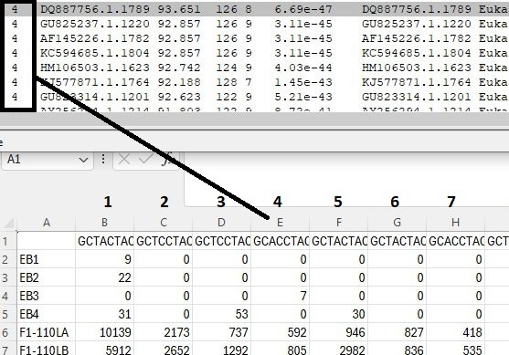

Figure 1: The ID (_qseqid_) value of 4 links to the 4th sequence data column in the matrix file. The first column is the sample name column, so the numbering starts at column B.

### Running on non-Windows PCs

___Taxonomy_NCBI___ is written in C#, which is geared towards Windows computers, but can be used on macOS or Linux/BSD computers with Intel or AMD processors using Wine, as described [here](https://github.com/msjimc/RunningWindowsProgramsOnLinux).

## The user interface

Figure 2 shows the ___Taxonomy_NCBI___ user interface which consists of five regions: 
- [___Import taxonomic data___](#importing-and-saving-the-ncbi-taxonomic-data) 
- [___Automated analysis___](#annotating-blast-hit-files-with-ncbi-taxonomic-data)  
- [___Combine annotation file read-count matrix___](#combining-the-annotated-blast-hit-file-and-the-read-count-matrix-file) 
- [___Filter and aggregate species data___](#filtering-and-aggregating-data) 
- [___Manual search___](#manually-searching-the-taxonomy-data)

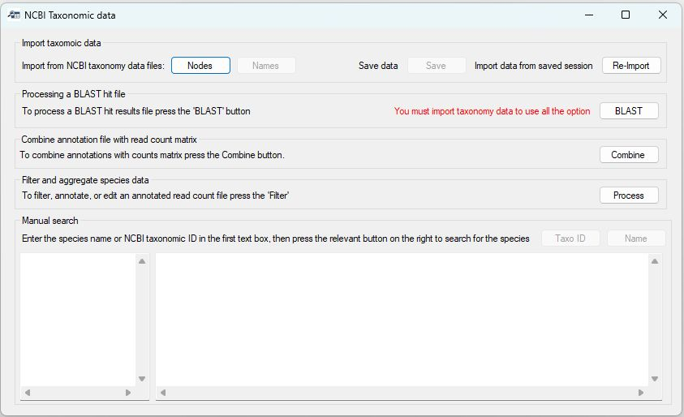

Figure 2 The user interface.

### Importing and saving the NCBI taxonomic data

The required taxonomic data downloaded from the NCBI website is present in two files: 
- The nodes.dmp contains the taxonomic ID of each taxonomic grouping (i.e., each species, family, or clade) along with its parent ID value. For instance, _Homo sapiens_ is linked to the _Homo_ genus, which in turn is linked to the 
_Homininae_ subfamily. 
- The names.dmp file contains the Latin and common names for each term.

Pressing the ___Nodes___ button in the ___Import taxonomic data___ panel allows you to select the "_nodes.dmp_" file, which creates the taxonomy tree where each term is connected to its parent term. In this tree, a species is a leaf, while the roots are the higher-level terms, such as ***Eukaryota***.  
While importing the data, the status is displayed in the window's title bar. When the data has been imported, the title will return to ***Taxonomic_NCBI*** and the ___Names___ button will become active. 

Pressing the ___Names___ button will allow you to select and import the "_names.dmp_" file. This adds the names to the taxonomic nodes previously imported. The task's status is shown in the title bar, which reverts to ***Taxonomic_NCBI*** when it has finished, and the ___Save___ button will become active. 

At  this point, the program is ready to use.

### Saving the node and names data to allow quicker import times

Loading the data from the "_nodes.dmp_" and "_names.dmp_" files is slow because the tree's structure must be recreated each time. Pressing the ___Save___ button  allows you to save the structured taxonomic data, which is then quicker to load using  the ___Re-Import___ button. 

### Manually searching the taxonomy data

Once the taxonomic data has been imported, you can manually look up taxonomic information by entering a list of species names or NCBI taxonomic IDs into the left‑hand text area of the ___Manual search___ panel. Pressing the ___Name___ button for text names (Figure 3a) or the ___Taxo ID___ for NCBI taxonomic IDs (Figure 3b) will then display their taxonomic information in the right-hand text box.  

***Note***: The texts must be all text names or all NCBI ID numbers.

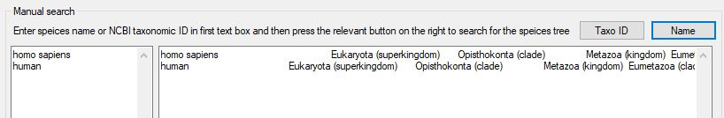

Figure 3a: Manually searching for the taxonomic database for species names by pressing the ___Name___ button.

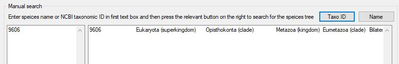

Figure 3b: Manually searching for the taxonomic database for NCBI taxonomic IDs by pressing the ___Taxo ID___ button (e.g., 9606 = human).

The taxonomic data is written to the right-hand text area, which does not word-wrap the text so that the lines in the left-hand area correspond to those in the right-hand area. If a name was not found, the line will be empty, and you will be given the option to ignore them - doing so will mean the names and results will no longer align. 

The whole line can be read using the horizontal scroll bar below the text area.

These functions are particularly useful when annotating species in an Excel file. Copy the column of interest from Excel, paste it into Taxonomy_NCBI, and run the search. If prompted, do not ignore empty lines. When the search is complete, copy the results from Taxonomy_NCBI back into Excel.

### Annotating BLAST hit files with NCBI taxonomic data

The annotation of a BLAST hit file is performed by pressing the ___Annotate___ button in the ___Automated analysis___ panel. Pressing this button prompts you to select a BLAST hit file. If the ___Process a folder of text files___ option is selected, ___Taxonomy_NCBI___ will process all the text files in the same folder, creating a single annotated BLAST hit file. When this option is used, ___Taxonomy_NCBI___ expects all the text files in the folder to be BLAST hit files containing sequences linked to a single read-counts matrix file. Once the input data has been selected, the ___Name location___ window will open, allowing you to specify the location of the species name in the description of sequences identified by BLAST as homologous to your amplicon sequence (Figure 4).

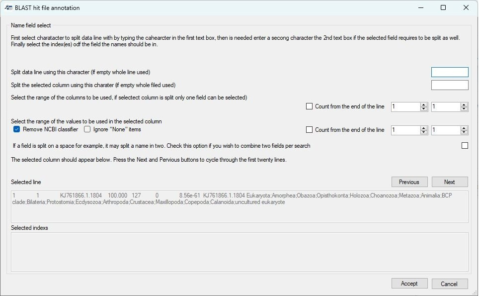

Figure 4: The ___Name location___ form allows you to select the hit sequence's name.

Due to the diverse sources of BLAST databases, the description of each sequence can vary widely. For example, the SILVA database of 16S and 18S sequences has a sequence name format of:

> KF848653.1.566&nbsp;Eukaryota;Amorphea;Obazoa;Opisthokonta;Nucletmycea;Fungi;Dikarya;Ascomycota;Pezizomycotina;Sordariomycetes;Hypocreales;Nectriaceae;Fusarium;Cytospora ceratosperma 

In which the taxonomic data (when present) is written from its root to its species name, with each term separated by a ';' character. While this may seem ideal, there is significant variation among different sequences in a SILVA dataset as to which rankings are included, so some sequences may have a family and superfamily term while another has neither.

The standard NCBI GenBank sequence description given in a BLAST hit file contains no taxonomic data, but should have the species name or a partial species (genus) name:

> Prorocentrum micans strain CCAP 1136/19 small subunit ribosomal RNA gene, partial sequence

As with the SILVA database, there is significant variation between the annotation of different sequences.

As a consequence of the variation between sequence descriptions, you will need to identify which piece of text in the BLAST hit file you wish to use. The form contains two text areas at the bottom of the window, with the upper area showing a line from the  BLAST hit file. The first 50 lines can be viewed in turn by pressing the ___Previous___ and ___Next___ buttons. Cycling through the lines will allow you to acquire a feel for the variation in the sequence descriptors.

In Figure 4, it is apparent that each line is split into a range of columns by the use of a "Tab" character; in other file, it may be another character, such as a comma or colon for each. The last column contains the sequence's description. This, in turn, can be split into a series of fields at the ';' character, with the last field containing a species name or a generic term. In Figure 5a, the unhelpful generic term  ***uncultured eukaryote*** is used. However, the previous term is ***Calanoida*** which does contain some relevant information. Therefore, to select these fields, you have to do four things:

1) First enter the text delimiter that splits the line in a range of fields, in this case it is a "Tab" character. Since pressing "Tab" on the keyboard will move the cursor to a new control, enter \\t in the top text area (blue box in figure 5a).
2) Then select the field you are interested in using the two number controls (red box in figure 5a).
If the two numbers are the same, only one field will be selected (Figure 5a), but if the numbers differ, more than one field will be selected (Figure 5b).

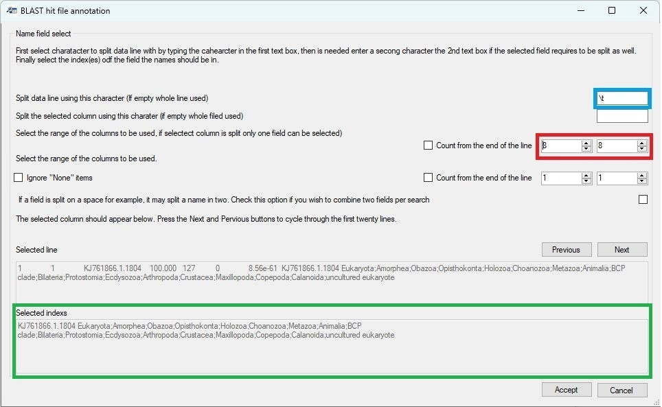

Figure 5a: The line is split into fields by entering the text delimiter (a tab) in the upper text area (blue box). The eighth field is then selected using the number controls in the red box. The selected fields are shown in the lowest text area (green box).

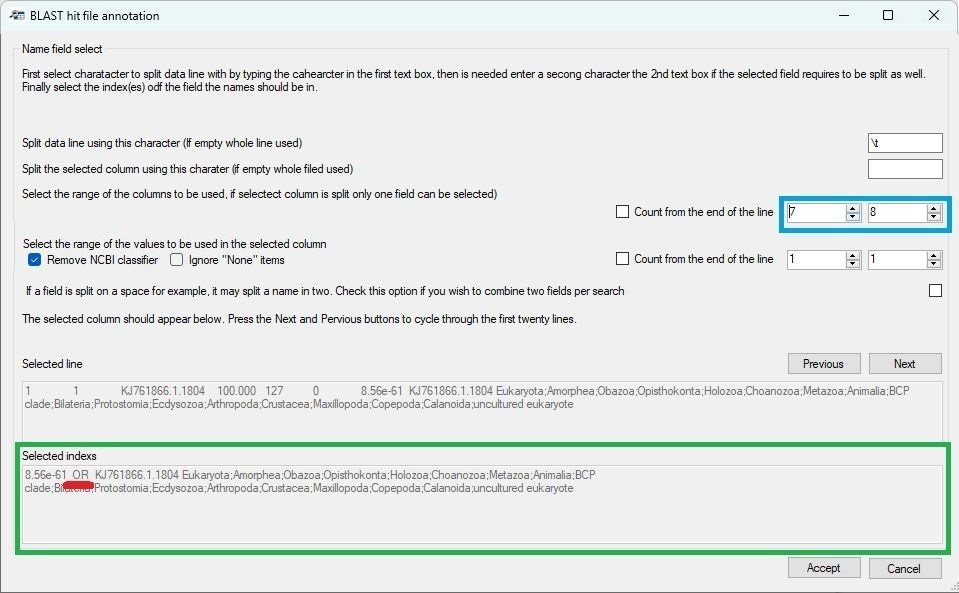

Figure 5a: The line is split into fields by entering the text delimiter (a tab) in the upper text area as before. However, the seventh and eighth fields are then selected using the number controls in the blue box. The selected fields are shown in the lowest text area (green box) with each value separated by the word ***OR*** (red line).

 

3) Since we need to split the final field to be able to select just the species name, enter the ';' character in the second text area (blue box in figure 6a). Entering this text delimiter will direct ___Taxonomic data___ to select only one field rather than two as shown in figure 5b. 

4) Since the number of sub-fields in a SILVA sequence descriptor varies, select the ___Count from the end of the line___ option (red box in Figure 6a). This counts the fields from the end rather than the start and will always select the correct field irrespective of the number of intermediate fields in the description. Since the last field sometimes contains a generic phrase, select the last two fields as shown in figure 6b (red box). The lowest text area now contains two terms separated by the word ***OR*** (Green box in Figure 6b).
 
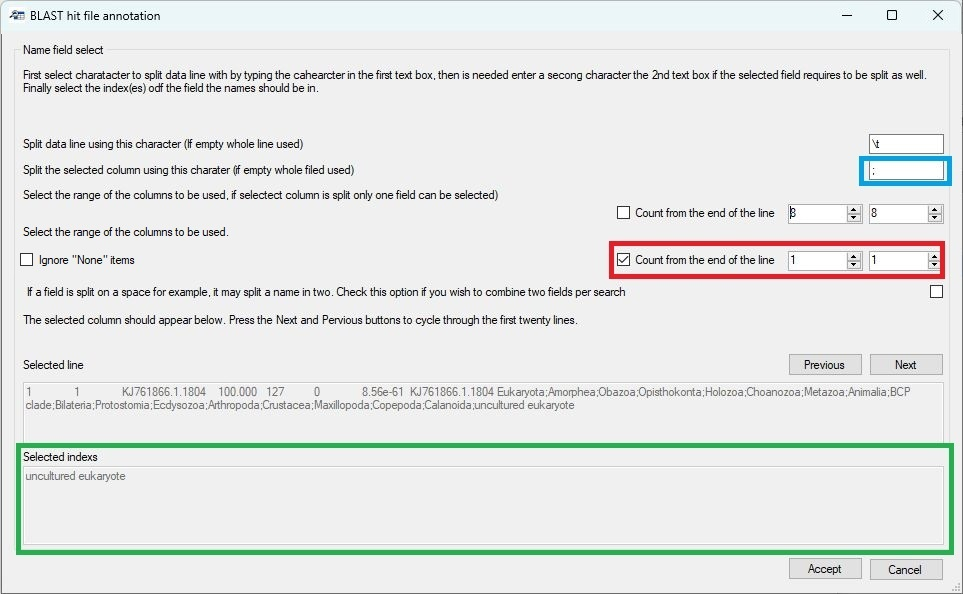

Figure 6a: Entering the ';' into the second text area (blue box) splits the selected field into sub-fields. Checking the  ___Count from the end of the line___ option selects the field counting backwards from the last of the field (red box). The selected sub-field is shown in the lowest text area (green box).

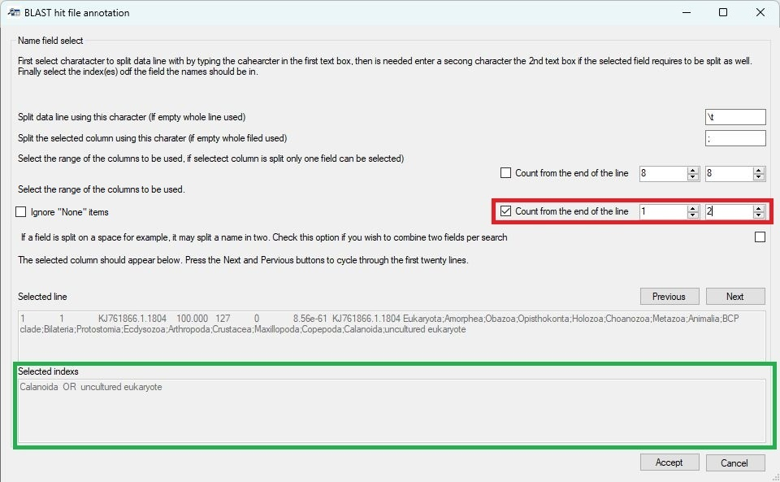

Figure 6b: Selecting two fields (red box) causes the last and second-to-last sub-fields to be shown in the lowest text area (green box) with each term separated by the word ***OR***.

When working with GenBank descriptions, the data line is split into fields using the Tab character (\\t) as before, but the descriptor is a series of words separated by a space. Consequently, enter a space (or a \\s character) in the second text area to split the descriptor up into words (black box in Figure 7). However, this will also split a species name into individual words rather than a two-word name. Also, GenBank descriptors may start with a generic term like ***uncultured sample***. To process this type of descriptor, select the first to fourth fields (blue box in Figure 7) and then check the ***Combine two fields*** option (red box in Figure 7). This will combine consecutive fields to form two-word queries (green box Figure 7).

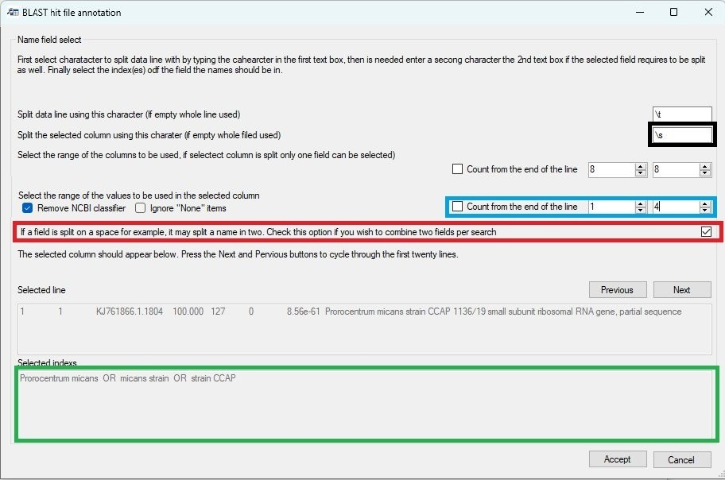

Figure 7: Using a space character (or \\s) will break a GenBank description into single words. Selecting the first four fields/words (blue box) should allow the analysis of a sequence prefixed with a generic phrase. Finally, selecting the ***Combine two terms*** option (red box) creates search terms consisting of two words.

When searching taxonomic data in the NCBI dataset, ___Taxonomic data___ processes the terms from right to left; for example, in Figure 7 it would first search for matches to ***strain CCAP***, then ***micans strain*** and finally ***Prorocentrum micans***. If it finds a match, it returns it and stops searching for possibly better ones. Consequently, it is important to check whether the search order is appropriate: if the probable best search term is at the start of the text in the lower text area, select the reverse search term option  (blue box in Figure 8a) to reverse the order (green box in Figure 8a).

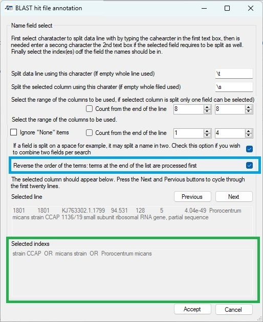

Figure 8a

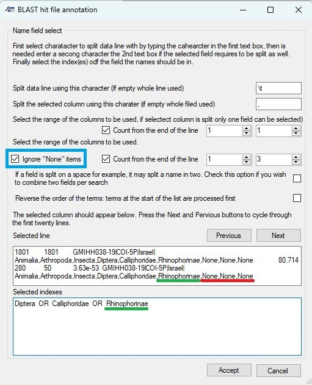

Figure 8b

If the sequences were annotated against the BOLD data set, instruct ___Taxonomy_NCBI___ to ignore fields containing the word "_None_" (red line in Figure 8b) by ticking the ___Ignore "None" items___ option (blue box in Figure 8b). This will remove the "None" fields from the subsequent taxonomic term searches (green line in the lower text box in Figure 8b).  

Finally, pressing the ___Accept___ button will process the entire BLAST hit file and create a new file with the same name as the BLAST hit file, but with ***_annotated*** appended to its name. In the new file, the field from which the search term is derived is removed, and the taxonomic string is appended to the end of the line after a text delimiter.

Since not all entries contain all the taxonomic subdivisions, ___Taxonomic_NCBI____ pads missing fields using the previous taxonomic rank prefixed by a '.' character, for example, a search for ***Gyrodinium*** returns the name of a genus, but not a species name; Consequently, the taxonomic string ended with ***Gyrodinium***\<tab>***.Gyrodinium***. The term ***.Gyrodinium*** is substituted for a species name with the '.' character indicating the substitution. A value of ***Eucalanidae***\<tab>***.Eucalanidae***\<tab>***..Eucalanidae*** indicates that the two taxonomic rankings following ***Eucalanidae*** are absent.

## Combining the annotated BLAST hit file and the read count matrix file

__Note:__ Once an annotated  BLAST hit file has been made, it can be combined with the linked read-count matrix file. Since this step does not require any taxonomic data from the NCBI taxonomy dataset, this step doesn't require you to import taxonomic data and so, is always available.

Pressing the ___Combine___ button on the ___Combine annotation file with read-count matrix___ panel will open the ___Combine files___ window (Figure 9). This form consists of two regions: the upper ___Matrix format and index column selection___ panel and the ___Annotation file selection___ panel. Initially the ___Annotation file selection___ panel is disabled and becomes active when options on the upper ___Matrix format and index column selection___ panel have been set.

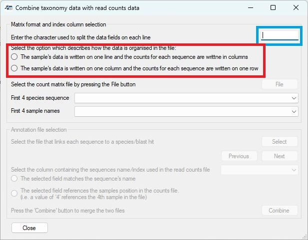

Figure 9

### Describing the read-count matrix file

The read-count matrix file must be a text file with data points on each row delimited by a single character such as a "Tab" character, which should be entered into the text area in the upper right of the form (blue box in Figure 9). Next the organisation of the matrix must be selected. The two radio buttons (red box in Figure 9) allow you to select whether the samples are arranged in columns with the sequences represented on each row or the columns represent the sequences and each row contains data for a single sample. 

Once the matrix's orientation is set, the ___File___ button will become active, allowing you to select the matrix file. Once entered, the first four species sequence names and the first four sample names will be entered into the list boxes (blue box in Figure 10) to allow you to check the selection is correct. Selecting the file will also activate the lower ___Annotation file selection___ panel.

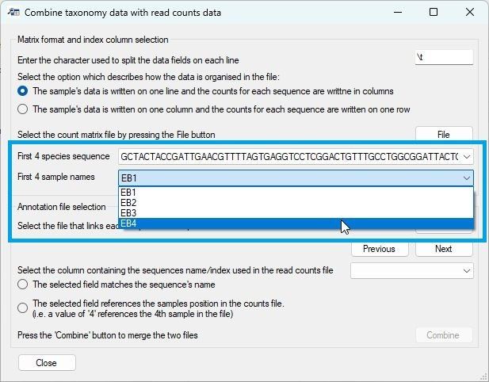

Figure 10

### Selecting the annotated BLAST hit file and choosing the sample ID field

The ___Annotation file selection___ panel contains the ___Select___ button (blue box in Figure 11), which allows you to import the annotated BLAST file. The first line of the selected file is then split into individual fields which are then entered into the dropdown list control (red box in Figure 11), allowing you to choose which field contains the data to be used to link a BLAST hit result with its species sequence in the read-count matrix. The ___Previous___ and ___Next___ buttons (green box in Figure 11) allow you to cycle through the first 50 lines to check that the selected field is the correct one.

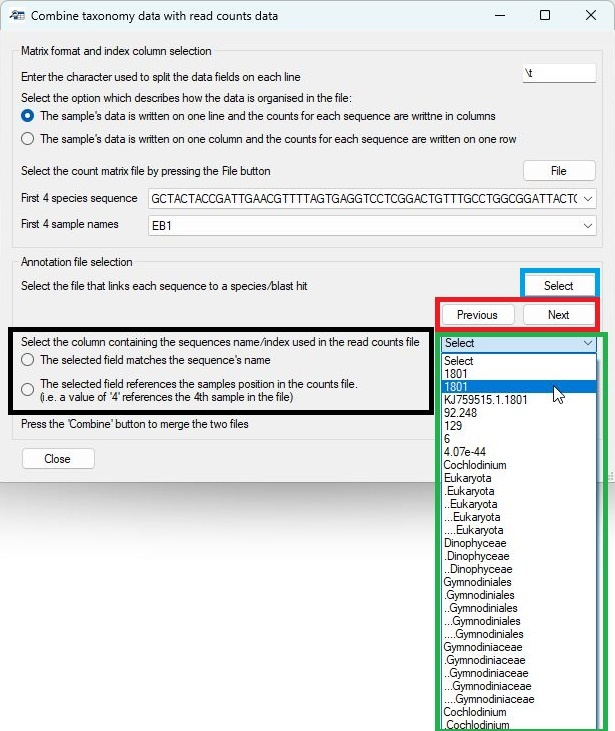

Figure 11: The annotated BLAST file is selected using the ___Select___ button (blue box), and the fields from a line in the file are used to populate the dropdown list control (green box) from which the field containing the sequence ID can be selected. The displayed line can be changed using the ___Next___ and ___Previous___ buttons.

#### Determining how the read-count matrix sequence ID links to the BLAST sequence ID

If the selected field in the BLAST hit annotated file contains the name of the species sequence, it will be matched to the sample name in the read-count matrix file if the ___The selected field matches the sequence's name___ option is checked (black box in Figure 11). However, if the ___The selected field references the sample's position in the counts file___ option is selected, the sequence ID will be treated as a number that represents the order of the sequences in the matrix file. If the sequence ID value in the BLAST hit file is '1' it will link the annotated hit data with the first sample in the read-count matrix file, whereas if the value is '153', it will link it to the 153rd sample in the count matrix file. 

***Note***: If the BLAST hit file contains a sequence, you need to make sure that the sequence is the amplicon's sequence and not the sequence from the alignment, which may be cropped or contain '-' characters. If it is the amplicon's sequence, it can match the one in the read count matrix file, but if it is the aligned sequence, it may not match due to cropping and '-' characters.

#### Combining the data files

Pressing the ___Combine___ button will create a third file whose name is made from combining the names of the input files. This will contain the read matrix organised such that the sample data is in columns and the sequence data is on each row. The annotated BLAST hit data is appended to the end of each row with the same character used to split the read-count matrix data into individual fields (blue box in Figure 9).

The first column will consist of the sequence's name in the species sequence ID appended to the end of the BLAST hit file's species sequence ID, allowing the accuracy of the combining to be determined. Figure 12 shows a combined data file opened in Excel in which only the first 4 sample data columns are shown along with the first 6 taxonomy divisions. 

## Filtering and aggregating data

Pressing the ___Filter___ button in the ___Filter and aggregate species data___ region of the ___Taxonomic_NCBI___ opens the ___Filter and aggregate species data___ window that allows the data to be filtered and aggregated before exporting to a tab-delimited text file.

Figure 12: The  ___Filter and aggregate species data___ window that enables the data to be filtered and/or aggregated.

___

### Importing data

__Note:__ The  ___Filter and aggregate species data___ window was developed to process files exported by ___Taxonomic_NCBI___; however, it may be possible to process data from other sources as long as the sequence data is stored across a line in the file, the first line contains the column names and not data and it contains the required fields.

Pressing the ___Select___ button (blue line in Figure 13) of the ___File selection___ panel prompts you to select the data file. Once imported, select the titles of the first and last sample columns using the two dropdown lists (green line in Figure 13). Once data has been imported and the sample columns are set, all the options on the ___Tasks___ panel will become active. 

Figure 13: Pressing the ___Select___ button (blue line) allows you to import the data file, while selecting the first and last sample column (green line) causes all regions of the window to become active.

___

The ___Tasks___ region contains five buttons, which, when pressed, open a new window that will perform a filtering, annotation, or aggregating task on the read-count data.

- [Filter species by a list of species names](#filter-species-by-a-list-of-species-names)
- [Filtering sequence data based on the quality of the BLAST hit](#filtering-sequence-data-based-on-the-quality-of-the-blast-hit)
- [Exclude data based on its read-count across all samples](#exclude-data-based-on-its-read-count-across-all-samples)
- [Combine read-count data based on its taxonomy grouping](#combine-read-count-data-based-on-its-taxonomy-grouping)
- [Append taxonomic data from different source](#appending-taxonomic-data-from-a-different-source)
- [Deleting unwanted columns](#deleting-unwanted-columns)

### Filter species by a list of species names

__Note:__ While this function was designed to screen data by species name, it can be used with any taxonomic group such as _genus_ or _family_.

An annotated dataset may contain a very wide range of species, some of which may be of interest while others may be seen as incidental findings irrelevant to the project. Furthermore, some annotations may link reads to a closely related species that is present in the database used to annotate the data but is not present in the sampled environment. Consequently, it is often useful to compare the species identified in the samples to a list of species, with data removed or retained based on any matches. Similarly, rather than removing data, it may be advantageous to mark the species as hits or misses, with their status used in subsequent analysis. Therefore, ___Taxomic_NCBI___ can screen annotated data against a list of taxonomic names via the ___Filter data against list of names___  window (Figure 14), which is opened by pressing the __List__ button (red line in Figure 13).

Figure 14: The  ___Filter data against list of names___ window allows data to be filtered by its taxonomic grouping.

---

__Screening the data consists of five steps:__

#### Importing a list of names

Pressing the __List__ button (blue line in Figure 14) prompts you to select a file that contains the names. This file must be formatted such that each line contains one name. The filtering is not case sensitive but will only identify exact matches. For example, NCBI's taxonomic data lists humans as _Homo sapiens_, so human sequences will match _homo sapiens_ and _Homo Sapiens_, but not _H. sapiens_ or human. Similarly, the term _Escherichia coli_ will not match with _Escherichia coli strain 91_ or _E. coli_.

#### Selecting the type of output

Whether a sequence is linked to a taxonomic name in the list may result in the sequence being retained, deleted or flagged as being in the list. This action is set using the three radio buttons (black lines in Figure 14) as follows.

- _Remove species in list_: the resultant data set doesn't contain data linked to names in the list.
- _Keep species in list_: the resultant data set only contains sequences linked to names in the list.
- _Flag sequences in list using name in text area as column header_: The resultant data contains all the sequences to which a new column has been appended that states whether the sequence was or was not in the list. The name of the append column is entered into the text box (blue line in Figure 15).

Figure 15.

---

#### Select the column to be screened

While this function was intended to screen the data against a list of species names, it can be used to screen any column. This means that, in addition to species names, any other taxonomic classification can also be used. The column used is selected using the dropdown list (red line in Figures 14 and 16).

Figure 16.

---

#### Performing the search

Once the previous three steps have been completed, the __Compare__ button will become active (green line in Figure 14), and pressing it will perform the comparison. Once complete, a message will appear telling you how many data rows were and were not in the list (Figure 17). If you select _Yes_ the results will be saved, while pressing _No_ will discard the analysis.  Once completed, it is possible to repeat the screening with a different list, with the results being accumulative.

Figure 17.

---

#### Saving the analysis

The results of the analysis are initially stored within the ___Filter data against list of names___ window and are not accessible by the rest of __Taxonomic_NCBI__. Therefore, to save the data, you must press the __Accept__ button (grey line in Figure 14). This will close the window and the results of the screening(s) replace the data in the __Taxonomic_NCBI__ program. The data can then be saved to a file by pressing the __Save__ button (purple line in Figure 13) or processed further by other functions on the ___Filter and aggregate species data___ window. Pressing the __Cancel__ button will discard the results and retain the original data.

### Filtering sequence data based on the quality of the BLAST hit

The data exported by __Taxonomic_NCBI__ after linking read data to taxonomic rank (see [Combining the annotated BLAST hit file and the read-count matrix file](#combining-the-annotated-blast-hit-file-and-the-read-count-matrix-file)) contains a _Percent identity_ and an _E score_ field as well as a _Hit length_. These columns can be used to filter the data to remove sequences that are likely to be incorrectly annotated. For example, poor hits can be removed by removing data that has a _Percent identity_ score below 99% or an _E score_ above 1.0e-20. Alternatively, amplicons that are either too long or too short to be the correct product can be removed by filtering twice for the _Hit length_, once setting the maximum length and then the minimum length.

Filtering by the numeric value in a field is performed by pressing the __BLAST__ button (yellow line on Figure 13). This will open the __Filter by BLAST value__ (Figure 18).

Figure 18.

---

The filtering by a BLAST hit value is performed with five steps as follows:

#### Select the column's name to be filtered

Select the name of the data column you wish to filter using the dropdown list (blue line in Figure 18) on the __Filter by BLAST value__ window.

#### Select how the filtering is performed

Selecting the __Retain data equal to or higher than cutoff__  (black line in Figure 18) should retain values lower than the cutoff, for example, when screening by  _E score_. The __Retain data equal to or higher than cutoff__ option (black line in Figure 18) should be used to keep values above the cutoff, for example, when filtering by _Percent identity_.  To remove amplicons that are the wrong size, first remove sequences that are too short and then perform a second round of filtering to remove sequences that are too long.

#### Entering the cutoff value

The cutoff value is entered in the text area (red line in Figure 18). This value can be any value that can be converted to a number. For example, _99_ and _98.5_ will be accepted. Very large or small decimal numbers can be entered using scientific notation, i.e., '1.0e-25' will be processed as '0.00000000000000000000000001'. __Note:__ the 'e' must be lowercase. If the value cannot be converted to a number, a red warning will appear by the text box (Figure 19).

Figure 19.

---

#### Preforming the analysis

Once the previous three steps have been performed, the __Filter__ button will become active and pressing it will filter the data. Once complete, a message will appear indicating how many data lines have been retained and how many were removed. Pressing the _Yes_ button will retain the analysis, while pressing _No_ will delete it. The data can be filtered a number of times with the results cumulative.

#### Saving the analysis

The results of the analysis are initially stored within the __Filter by BLAST value__ window and are not accessible by the rest of __Taxonomic_NCBI__. Therefore, to save the data, you must press the __Accept__ button (grey line in Figure 18). This will close the window and the results of the screening(s) will replace the data in the __Taxonomic_NCBI__ program. The data can then be saved to a file by pressing the __Save__ button (purple line in Figure 13) or processed further by other functions on the ___Filter and aggregate species data___ window. Pressing the __Cancel__ button will discard the results and retain the original data.

### Exclude data based on its read count across all samples

An issue with any eDNA or microbiome analysis is the presence of a large number of sequences that are the result of a sequencing or PCR replication error. These sequences are often linked to very few reads and so can be safely deleted. To delete data rows that reference very few reads, press the __Counts__ button (black line in Figure 13). This will open the __Filter by total read count__ window (Figure 20).

Figure 20.

---

The filtering by a BLAST hit value is performed with three steps as follows:

#### Entering the minimum accumulative read-count cutoff

This value can be any value that can be converted to a number. For example _2000_ and _98.5_ will be accepted. Large numbers can be entered using  scientific notation, i.e., 1.0e4 will be read as 1,0000. __Note:__ the 'e' must be lowercase. If the value cannot be converted to a number, the __Filter__ button used for the next step will not become active and no analysis can be performed.  

#### Performing the filtering

Pressing the __Filter__ button will prompt __Taxonomic_NCBI__ to calculate the number of reads linked to each row in the data set, and if the value is less than the cutoff, the line is deleted. Once the analysis is complete, a message will appear stating the number of data rows and linked reads that were retained or deleted (Figure 21).

Figure 21.

---

#### Saving the analysis

The results of the analysis are stored within  the __Filter by total read-count__ window and are not accessible by the rest of __Taxonomic_NCBI__. Therefore, to save the data, you must press the __Accept__ button (grey line in Figure 18). This will close the window and the results of the screening(s) replace the data in the __Taxonomic_NCBI__ program. The data can then be saved to a file by pressing the __Save__ button (purple line in Figure 13) or processed further by other functions on the ___Filter and aggregate species data___ window. Pressing the __Cancel__ button will discard the results and retain the original data.

### Combine read count data based on its taxonomy grouping

Many datasets contain a large number of species, which may make displaying the data difficult. Consequently, the data set may be filtered to remove data that is not required. Alternatively, data may be aggregated at the genus or family taxonomic level so that any subsequent analysis is performed at a higher taxonomic ranking. __Taxonomic_NCBI__ can aggregate data rows based on their taxonomic grouping, such as genus or family. 

__Note:__ Occasionally, a data set may contain multiple data rows linked to the same species; in this case, it may be beneficial to aggregate data at the species level.

__Note:__ When aggregating the data, the 'none' read-count information is retained from the first data row that matches a taxonomic identifier. Consequently, filtering on the value of a BLAST hit after aggregation will be unreliable.

__Note:__ When aggregating data rows, all columns after the filtering taxonomic class are deleted. This means that the taxonomic data must be at the end of each data row and if the data rows have been flagged using the [__Filter species by a list of species names__ > __Flag sequences in list using name in text area as column header__](#filter-species-by-a-list-of-species-names) function, this data will be lost.

__Note:__ All species contain all the taxonomic groupings used in the NCBI's taxonomic scheme. For instance, while all species have a _family_ value, not all species have a _subfamily_.

Aggregating data rows based on their taxonomy annotation is performed by pressing the __Combine__ button (lime line on Figure 13). This will open the __Aggregate by taxonomy__  window (Figure 22).

Figure 22.

---

Aggregating data is performed in three steps: 

#### Select the column used to aggregate the data

Select the name of the data column you wish to use in the aggregation process using  the dropdown list (blue line in Figure 18) on the __Aggregate by taxonomy__ window.

#### Perform the aggregation step

Once the relevant data column has been selected, the __Combine__ button (red line in Figure 22) will become active. Pressing this button will start the aggregation of the data and when complete, a message will appear comparing the number of data rows were created to the number in the initial dataset (Figure 23).

Figure 23.

---

#### Saving the analysis

The results of the analysis are initially stored within  the __Aggregate by taxonomy__ window and are not accessible by the rest of __Taxonomic_NCBI__. Therefore, to save the data, you must press the __Accept__ button (grey line in Figure 22). This will close the window and the results of the aggregation step replace the data in the __Taxonomic_NCBI__ program. The data can then be saved to a file by pressing the __Save__ button (purple line in Figure 13) or processed further by other functions on the ___Filter and aggregate species data___ window. Pressing the __Cancel__ button will discard the results and retain the original data.

### Appending taxonomic data from a different source

While the NCBI's taxonomic schema is used by many people, it does have known issues. Consequently, users may wish to append taxonomic annotation from a different source to each data row. These schemas may be curated by sources such as BOLD, SILVA, MIMt, PR2 or WoRMS. The [Bash and Python](../Bash_and_Python_scripts/) folder contains a number of scripts that may be useful in generating files containing various taxonomic schemas from these sources.

Pending taxonomic data to each data row is performed by pressing the __Append__ button (pink line on Figure 13). This will open the __Append taxonomic data to a file__  window (Figure 24).

Figure 24.

---

Appending data is performed in five steps as follows:

#### Importing the taxonomic data

The taxonomic data is imported as a text file by pressing the __Select__ button (blue line in Figure 24). In this file each line contains a species' taxonomic data, with each ranking separated by a 'Tab' character. Ideally, the first line will contain the name for each taxonomic ranking (i.e. _species_, _family_ or _genus_). If it is not possible to get this data, the first line should be empty and __Taxonomic_NCBI__ will refer to each column by the letters __A__ to __Z__, if there are more entries, the subsequent columns will be labelled __AA__ to __AZ__ and then __BA__ to __BZ__ and so on.

#### Selecting the NCBI taxonomic ranking column

Use the upper dropdown list (red line in Figure 24) to select the taxonomic rank used by the NCBI schema you wish to link to the new taxonomic schema. 

#### Select the taxonomic ranking in the new schema

Use the lower dropdown list (black line in Figure 24) to select the taxonomic rank used by the new schema you wish to link to NCBI's taxonomic schema. 

#### Appending the data

Once the previous three steps have been performed, the __Append__ button (green line in Figure 24) will be activated and pressing it starts the process. Once it has been completed, a message will appear stating how many data rows have and have not been modified.

#### Saving the analysis

The results of the analysis are initially stored within  the __Append taxonomic data to a file__ window and are not accessible by the rest of __Taxonomic_NCBI__. Therefore, to save the data, you must press the __Accept__ button (grey line in Figure 24). This will close the window and the results of this analysis step will replace the data in the __Taxonomic_NCBI__ program. The data can then be saved to a file by pressing the __Save__ button (purple line in Figure 13) or processed further by other functions on the ___Filter and aggregate species data___ window. Pressing the __Cancel__ button will discard the results and retain the original data.

### Deleting unwanted columns

The annotation read-count matrix may contain a number of columns that are not required for any subsequent analysis and so can safely be removed from the data set. This can be performed by pressing the __Remove__ button (**brown** line on Figure 13), which will open the __Remove data columns__  window (Figure 24).

Figure 25.

---

The removal of unwanted columns is performed in 3 steps:

#### Selecting the unwanted columns

When the __Remove data columns__ window opens, each column header name is displayed by a tick box (red box in Figure 25). Checking the tick box selects the related column for removal from the data set. For instance, Figure  25 shows the _Fasta name_, _Hit length_, _Alignment identities_, _Hit accession_ and _Hit name_ columns are marked for removal.

__Note:__ Any column can be removed.

#### Removing the columns

Pressing the __Remove__ button (blue line in Figure 25) will delete the selected data columns from the data set. When completed, a message appears asking if you want to save the changes to the local copy of the data. If the changes are accepted, the __Remove data columns__  window's __Accept__ button becomes active.

#### Saving the changes to a file

The results of the analysis are stored within  the __Remove data columns__ window and are not accessible to the rest of __Taxonomic_NCBI__. Therefore, to save the data, you must press the __Accept__ button (grey line in Figure 25). This will close the window and the new data set will replace the original one held by __Taxonomic_NCBI__. The data can then be saved to a file by pressing the __Save__ button (purple line in Figure 13) or processed further by other functions on the ___Filter and aggregate species data___ window. Pressing the __Cancel__ button will discard the results and retain the original data.