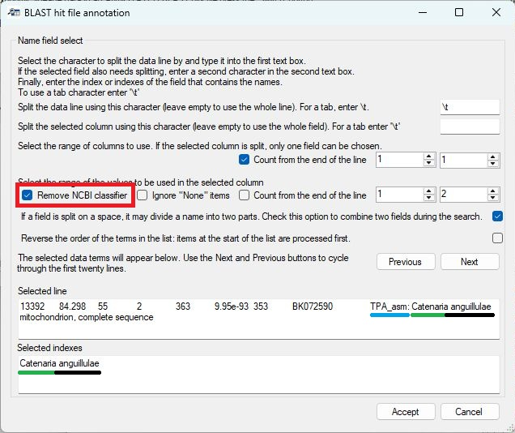
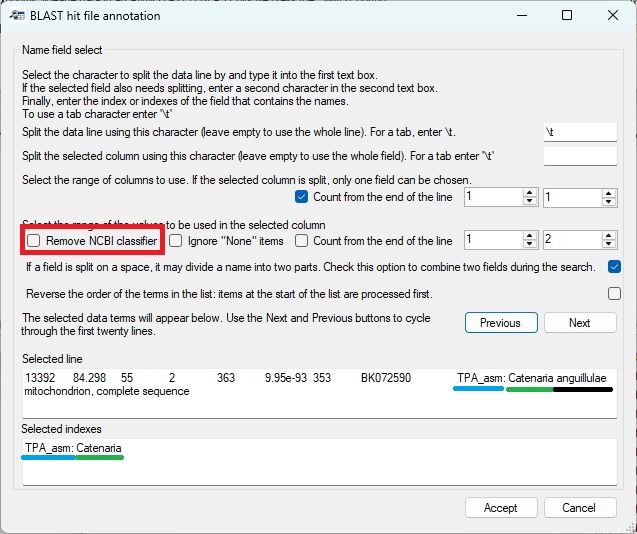

## User Guide

- [Main](README.md)
   - [Manually search the taxonomy data](manualSearch.md)
   - [Process a BLAST hits result file](processABLASTHitFile.md)
        - Annotate BLAST hit file
        - [Edit annotated BLAST hit file](editingTheBlastAnnotationFile.md)
   - [Link annotated Blast hits to read-count file](linkReadCountsToTaxonomicData.md)
   - [Filtering, editing and aggregate the annotated read counts file](filteringAndAggregatingData.md)  

# Annotating BLAST hit files with NCBI taxonomic data

The annotation of a BLAST hit file is performed by pressing the ___Annotate___ button in the ___Automated analysis___ panel. Pressing this button prompts you to select a BLAST hit file. If the ___Process a folder of text files___ option is selected, ___Taxonomy_NCBI___ will process all the text files in the same folder, creating a single annotated BLAST hit file. When this option is used, ___Taxonomy_NCBI___ expects all the text files in the folder to be BLAST hit files containing sequences linked to a single read-counts matrix file. Once the input data has been selected, the ___Blast hit file annotation___ window will open, allowing you to specify the location of the species name in the description of sequences identified by BLAST as homologous to your amplicon sequence (Figure 1).

Figure 1: The ___Blast hit file annotation___ form allows you to select the hit sequence's name.

Due to the diverse sources of BLAST databases, the description of each sequence can vary widely. For example, the SILVA database of 16S and 18S sequences has a sequence name format of:

> KF848653.1.566&nbsp;Eukaryota;Amorphea;Obazoa;Opisthokonta;Nucletmycea;Fungi;Dikarya;Ascomycota;Pezizomycotina;Sordariomycetes;Hypocreales;Nectriaceae;Fusarium;Cytospora ceratosperma 

In which the taxonomic data (when present) is written from its root to its species name, with each term separated by a ';' character. While this may seem ideal, there is significant variation among different sequences in a SILVA dataset as to which rankings are included, so some sequences may have a family and superfamily term while another has neither.

The standard NCBI GenBank sequence description given in a BLAST hit file contains no taxonomic data, but should have the species name or a partial species (genus) name:

> Prorocentrum micans strain CCAP 1136/19 small subunit ribosomal RNA gene, partial sequence

As with the SILVA database, there is significant variation between the annotation of different sequences.

As a consequence of the variation between sequence descriptions, you will need to identify which piece of text in the BLAST hit file you wish to use. The form contains two text areas at the bottom of the window, with the upper area showing a line from the  BLAST hit file. The first 50 lines can be viewed in turn by pressing the ___Previous___ and ___Next___ buttons. Cycling through the lines will allow you to acquire a feel for the variation in the sequence descriptors.

In Figure 1, it is apparent that each line is split into a range of columns by the use of a "Tab" character; in other file, it may be another character, such as a comma or colon for each. The last column contains the sequence's description. This, in turn, can be split into a series of fields at the ';' character, with the last field containing a species name or a generic term. In Figure 2a, the unhelpful generic term  ***uncultured eukaryote*** is used. However, the previous term is ***Calanoida*** which does contain some relevant information. Therefore, to select these fields, you have to do four things:

1) First enter the text delimiter that splits the line in a range of fields, in this case it is a "Tab" character. Since pressing "Tab" on the keyboard will move the cursor to a new control, enter \\t in the top text area (blue box in Figure 2a).
2) Then select the field you are interested in using the two number controls (red box in Figure 2a).
If the two numbers are the same, only one field will be selected (Figure 2a), but if the numbers differ, more than one field will be selected (Figure 2b).

Figure 2a: The line is split into fields by entering the text delimiter (a tab) in the upper text area (blue box). The eighth field is then selected using the number controls in the red box. The selected fields are shown in the lowest text area (green box).

Figure 2a: The line is split into fields by entering the text delimiter (a tab) in the upper text area as before. However, the seventh and eighth fields are then selected using the number controls in the blue box. The selected fields are shown in the lowest text area (green box) with each value separated by the word ***OR*** (red line).

 

3) Since we need to split the final field to be able to select just the species name, enter the ';' character in the second text area (blue box in Figure 3a). Entering this text delimiter will direct ___Taxonomic data___ to select only one field rather than two as shown in Figure 2b. 

4) Since the number of sub-fields in a SILVA sequence descriptor varies, select the ___Count from the end of the line___ option (red box in Figure 3a). This counts the fields from the end rather than the start and will always select the correct field irrespective of the number of intermediate fields in the description. Since the last field sometimes contains a generic phrase, select the last two fields as shown in Figure 3b (red box). The lowest text area now contains two terms separated by the word ***OR*** (Green box in Figure 3b).
 

Figure 3a: Entering the ';' into the second text area (blue box) splits the selected field into sub-fields. Checking the  ___Count from the end of the line___ option selects the field counting backwards from the last of the field (red box). The selected sub-field is shown in the lowest text area (green box).

Figure 3b: Selecting two fields (red box) causes the last and second-to-last sub-fields to be shown in the lowest text area (green box) with each term separated by the word ***OR***.

When working with GenBank descriptions, the data line is split into fields using the Tab character (\\t) as before, but the descriptor is a series of words separated by a space. Consequently, enter a space (or a \\s character) in the second text area to split the descriptor up into words (black box in Figure 4). However, this will also split a species name into individual words rather than a two-word name. Also, GenBank descriptors may start with a generic term like ***uncultured sample***. To process this type of descriptor, select the first to fourth fields (blue box in Figure 4) and then check the ***Combine two fields*** option (red box in Figure 4). This will combine consecutive fields to form two-word queries (green box Figure 4).

Figure 4: Using a space character (or \\s) will break a GenBank description into single words. Selecting the first four fields/words (blue box) should allow the analysis of a sequence prefixed with a generic phrase. Finally, selecting the ***Combine two terms*** option (red box) creates search terms consisting of two words.

When searching taxonomic data in the NCBI dataset, ___Taxonomic data___ processes the terms from right to left; for example, in Figure 4 it would first search for matches to ***strain CCAP***, then ***micans strain*** and finally ***Prorocentrum micans***. If it finds a match, it returns it and stops searching for possibly better ones. Consequently, it is important to check whether the search order is appropriate: if the probable best search term is at the end of the text in the lower text area, select the reverse search term option  (blue box in Figure 5a) to reverse the order (green box in Figure 5a).

Figure 5a

Figure 5b

If the sequences were annotated against the BOLD data set, instruct ___Taxonomy_NCBI___ to ignore fields containing the word "_None_" (red line in Figure 5b) by ticking the ___Ignore "None" items___ option (blue box in Figure 5b). This will remove the "None" fields from the subsequent taxonomic term searches (green line in the lower text box in Figure 5b).  

Finally, pressing the ___Accept___ button will process the entire BLAST hit file and create a new file with the same name as the BLAST hit file, but with ***_annotated*** appended to its name. In the new file, the field from which the search term is derived is removed, and the taxonomic string is appended to the end of the line after a text delimiter.

Since not all entries contain all the taxonomic subdivisions, ___Taxonomic_NCBI____ pads missing fields using the previous taxonomic rank prefixed by a '.' character, for example, a search for ***Gyrodinium*** returns the name of a genus, but not a species name; Consequently, the taxonomic string ended with ***Gyrodinium***\<tab>***.Gyrodinium***. The term ***.Gyrodinium*** is substituted for a species name with the '.' character indicating the substitution. A value of ***Eucalanidae***\<tab>***.Eucalanidae***\<tab>***..Eucalanidae*** indicates that the two taxonomic rankings following ***Eucalanidae*** are absent.

When working with GenBank accession sequence description, they may start with a classifier such as _PREDICTED:_, _TPA\_asm:_, or _MAG:_. This text may then be followed by a suitable taxonomic term that would be missed because of the prefix. By default, ___Taxonomy_NCBI___ removes any the first word of a description is it ends with a _':'_. For example, _PREDICTED:_ will be ignored, but _PREDICTED_ will not. Unchecking the __Remove NCBI classifier__ will stop this behaviour (see Figures 6a and 6b). 

Figure 6a: If __Remove NCBI classifier__ is checked the _TPA\_asm_ will be ignored.

Figure 6bIf __Remove NCBI classifier__ is unchecked the _TPA\_asm_ will be present in the text used to identify the correct taxonomic lineage.

## User Guide

- Main
   - [Manually search the taxonomy data](manualSearch.md)
   - [Process a BLAST hits result file](processABLASTHitFile.md)
        - [Annotate BLAST hit file](annotateBlastHitFile.md)
        - [Edit annotated BLAST hit file](editingTheBlastAnnotationFile.md)
   - [Link annotated Blast hits to read-count file](linkReadCountsToTaxonomicData.md)
   - [Filtering, editing and aggregate the annotated read counts file](filteringAndAggregatingData.md)
