## User Guide

- [Main](README.md)
   - [Manually search the taxonomy data](manualSearch.md)
   - [Annotate BLAST hit file](annotateBlastHitFile.md)
   - Edit annotated BLAST hit file
   - [Link annotated Blast hits to read-count file](linkReadCountsToTaxonomicData.md)
   - [Filtering, editing and aggregate the annotated read counts file](filteringAndAggregatingData.md)
  

# Processing an annotated hit file

## Switch taxonomic data linked to a sequence

Once a file has been annotated, the taxonomic data linked to a sequence can be switched to that of another species. This may be necessary if the hit species is not expected in the sampled environment, but a closely related species with a very similar sequence is. To switch a sequences taxonomic, it is necessary to first identify all the species linked to the dataset and then create a paired list file formatted as __"unexpected species name" \<tab> "preferred species name"__, for example see the table below: 

|Hit species|Divider character|Preferred species|
|-|-|-|
|Acanthurus achilles|\<tab>|Acanthurus xanthopterus|
|Acanthurus bariene|\<tab>|Acanthurus xanthopterus|
|Acanthurus triostegus|\<tab>|Acanthurus xanthopterus|
|Acentrogobius moloanus|\<tab>|Acentrogobius pflaumii|
|Acentrogobius sp.|\<tab>|Acentrogobius pflaumii|

In the table above the three different __Acanthurus__ species will be annotated as __Acanthurus xanthopterus__, while __Acentrogobius moloanus__ and __Acentrogobius sp.__ are renamed __Acentrogobius pflaumii__.

### Getting the names of species in an annotated BLAST hits file

A reasonable starting point in this process is to identify all the species linked to the sequences in the read count table. Pressing the ___Names___ button in the ___Processing a BLAST hit file___ panel (Figure 1) while open the ___Get names___ window (Figure 2) 

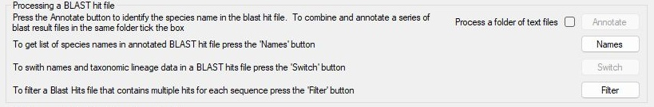

Figure 1.

---

Pressing the ___Select___ button (Figure 2) allows you to select an annotated BLAST hits file created as described on the [annotating a BLAST hits file](annotateBlastHitFile.md) page.

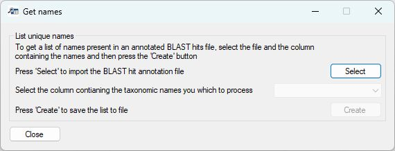

Figure 2.

---

Once the file has been imported, the dropdown list will be populated with the column names present in the file. This allows you to select the appropriate taxonomic rank column, in this case the __Species__ column (Figure 3).

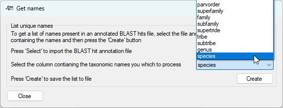

Figure 3.

---

Once the appropriate column has been selected, pressing the ___Create___ button will create a file that contains all the unique text, in this case species names, in the file. If the BLAST search was performed using the SGE or SLURM scripts in the [Bash and Python scripts](../Bash_and_Python_scripts) folder, each sequence will be linked to up to 20 hits, and so the list of names may include more names than sequences in the read-count file. This file could then be used as the basis to create a file containing the name of unexpected species followed by the name of an expected close relative to be used in the next step.

### Switch the taxonomic data for unexpected species with that of expected related species.

___Important point:___ all the other functions of ___Taxonomy_NCBI___ are comparatively lax in the required file structure; however, this function expects the species name to be in the last column of each row and the taxonomic data is in the same format/length as that derived from ___Taxonomy_NCBI___'s annotation of a BLAST hit file with NCBI taxonomy data.

For annotation in an annotated BLAST hits file to be edited, ___Taxonomic_NCBI___ must hold the NCBI taxonomy data which can be imported as described [here](README.md/#importing-and-saving-the-ncbi-taxonomic-data). Once imported, the ___Switch___  button in the ___Processing a BLAST hit file___ panel (Figure 1) will be activated. Pressing the ___Switch___ button will open the ___Switch taxonomic lineage___ window (Figure 4).

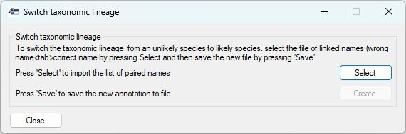

Figure 4.

---

Pressing the ___Select___ button will prompt you to select the text file of the paired unexpected and expected species names as described [above](#switch-taxonomic-data-linked-to-a-sequence). As each name pair is imported, __Taxonomy_NCBI___ uses the name of the expected species to search the NCBI taxonomy data to create its taxonomic lineage text, which is then linked to the unexpected species' name.

Once imported paired-name  file has been processed, the __Create___ button will become active, allowing you to select the annotated BLAST hit file to be processed. As ___Taxonomy_NCBI___ reads this file it reads the text in the last column of the file and uses it to search the list of alternative taxonomy lineages created when reading the paired name file.  If a match is found, its taxonomic data is replaced by the taxonomic data for the expected species. 

Once completed, ___Taxonomy_NCBI___ will create a new file named after the BLAST hit file to which __"\_names\_switched"__ has been appended. This file as the same structure as the original file except a new column named __Changed__ was appended to the data. This column is used to indicate how the data in each row was processed, as follows:

- If the species name was not in the unexpected name list.    
    - The column contains the text __"No change"__.
- The name was in the unexpected name list.   
    - The column contains the text __"Original name: "__ followed by the original species name that was replaced.
- The name was in the unexpected name list, but the new name was not found in the taxonomic data.  
    - The column contains the text __"Original name: "__ followed by the original species name that was replaced.   
The text contains the name of the unexpected species followed by __": not found"__. In this case, the original taxonomic data is retained. 

## Filtering the annotated BLAST hit file with multiple hits per sequence

If the BLAST hit data was created using the SGE or SLURM scripts in the [Bash and Python scripts](../Bash_and_Python_scripts) folder, each sequence will be linked to up to 20 hits and so each sequence may be annotated a number of different ways. For instance, the same sequence could be linked to _Acanthurus achilles_, _Acanthurus bariene_, _Acanthurus triostegus_, _Acanthurus moloanus_ and _Acanthurus sp._ It could be possible to filter the hits based on which name appears first in the BLAST hit file; however, this is unlikely to be ideal. Therefore, ___Taxonomy_NCBI_ allows you to filter the hits by the quality of the hit or by the presence of the hit's species name in a file of names to include or exclude. This filtering is initiated by pressing the ___Filter___ button in the in the ___Processing a BLAST hit file___ panel (Figure 1). This will open the ___Filter the annotated BLAST hit file___ window (Figure 5). 

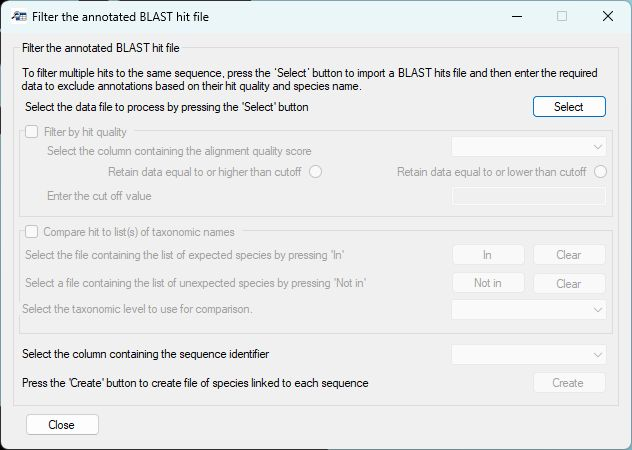

Figure 7.

---

### Importing an annotated BLAST hit file

Pressing the ___Select___ button in the top right of the form will prompt you to select the file's name. Once imported, the ___Filter by Hit quality___ and ___Compare hit to list of expected species___ panels will become active along with the lower dropdown list and the ___Create___ button. While the two panels will become active, their contents will not be active unless you tick the box by the panel's title.

### Filtering the hits

It is possible to filter the BLAST hits by the value of the alignment and/or the name of the species of the BLAST hit. If multiple hits have the same top ranking, the first hit in the BLAST hit file is used. 

### Filtering by hit quality

Checking the box by the ___Filter by Hit quality___ panels name will activate the panel's contents (Figure 8).

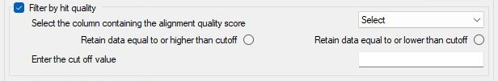

Figure 8.

---

These controls allow you to filter the hits based on whether a numeric value is above or below a user-defined cutoff. For BLAST hits created using the SGE or SLURM scripts in the [Bash and Python scripts](../Bash_and_Python_scripts) folder, each hit will have an _e Value_, _percent identities_, _BitScore_ and an _alignment length_, which can be filtered based on their value as outlined in the table below.

|Value|Description|
|-|-|
|Percent identities|This value indicates how similar the sequence is to the hit sequence; for species level analysis this should be 99%, while at the genus level, it could be 95%. The ___Retain data equal to or higher than cutoff___ option should be selected for this comparison (Figure 9a).|
|e Value|The score value ranges from 1 to 0, with 0 indicating a very good match. Typically, these values are shown as a value like 1.0e-30; consequently, the cutoff value should be very small, such as 1.0e-20 and the ___Retain data equal to or lower than cutoff___ option selected (Figure 9b).|
|BitScore|This value starts at 0 for a very poor match and increases in value as the match becomes more certain. Its value depends on the sequence and database size; for searches against the BLAST NT-core database, a cutoff of around 300 would be OK when used with the ___Retain data equal to or higher than cutoff___ option (Figure 9c).|
|Alignment length|This can be used to filter the hits above a minimum length (Figure 9d) and then again for those below a length  (Figure 9e).|

---

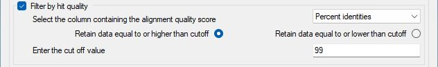

Figure 9a: Filtering hits based on the percent identities value.

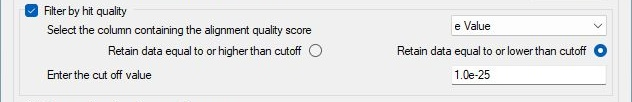

Figure 9d Filtering hits based on the e Value value.

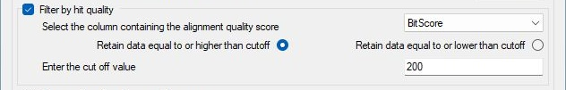

Figure 9c Filtering hits based on the Bit Score value.

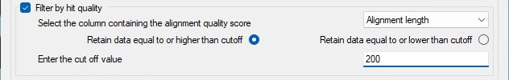

Figure 9d Filtering hits based on the minimum alignment length.

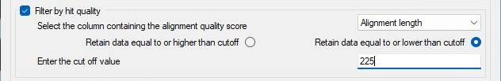

Figure 9e Filtering hits based on the maximum alignment length.

---

If you wish to filter the hits based on the species suggested by the hit, select the parameters as described in the [Filter by species name](#filter-by-species-name) section; otherwise set the column that contains the sequence's Id (FASTA name) from the dropdown list just above the ___Create___ button at the bottom of the form and then press the ___Create___ button.

### Filter by species name

To filter the hits by the name of a taxonomic ranking, tick the box next to the ___Compare hit to list(s) of taxonomic names___ to activate the required controls (Figure 10).

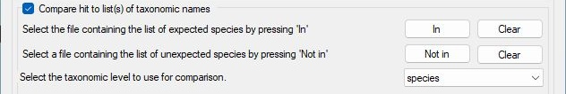

Figure 10.

---

Once checked, the panel will become active, allowing you to select files containing the names that you wish to be present in the filtered day and the names you don't want in the final data set. Each file is expected to be a plain text file with one name per line. The file of expected names is imported by pressing the ___In___ button (Figure 10), while the file of unwanted names is selected by pressing the ___Not in___ button (Figure 10). To clear each list of names, press the ___Clear___ button to the right of the appropriate import button.

Once the list(s) of names to be included and excluded have been imported, select the column of the taxonomic ranking you wish to filter by (i.e., if the lists are genus names, select the Genus column; if they are species names, select the species column).

If you wish to filter the hits based on their quality, select the parameters as described in the [Filtering by Hit quality](#filtering-by-hit-quality) section; otherwise set the column that contains the sequence's Id (fasta name) from the dropdown list just above the ___Create___ button at the bottom of the form and then press the ___Create___ button.

### Notes on the order of filtering steps

If the hits are filtered by name and a hit quality score, the hits are filtered by the quality score first. The hits are then compared to the list of expected names. If the name is in the list, it is compared to the 'Not in' list and retained even if it is in the expected list.

- If you filter by "hit quality", the hit with the best score that passes the name test is retained. If there are several hits with the same value, the first hit is used.

- If you filter by "hit quality and names", the hit with the best score is retained. If there are several hits with the same value, the first hit is used.

- If you filter by "name" only, the first hit is retained. This may not have the best alignment quality and so it may be sensible to always filter by hit quality, but use a cutoff such as zero that all hits will pass, will be filtered by quality as well.

## User Guide

- [Main](README.md)
   - [Manually search the taxonomy data](manualSearch.md)
   - [Annotate BLAST hit file](annotateBlastHitFile.md)
   - Edit annotated BLAST hit file
   - [Link annotated Blast hits to read-count file](linkReadCountsToTaxonomicData.md)
   - [Filtering, editing and aggregate the annotated read counts file](filteringAndAggregatingData.md)
  
