## User Guide

- [Main](README.md)
   - [Manually search the taxonomy data](manualSearch.md)
   - [Process a BLAST hits result file](processABLASTHitFile.md)
        - [Annotate BLAST hit file](annotateBlastHitFile.md)
        - [Edit annotated BLAST hit file](editingTheBlastAnnotationFile.md)
   - [Link annotated Blast hits to read-count file](linkReadCountsToTaxonomicData.md)
   - Filtering, editing and aggregate the annotated read counts file

# Filtering and aggregating data

Pressing the ___Filter___ button in the ___Filter and aggregate species data___ region of the ___Taxonomic_NCBI___ opens the ___Filter and aggregate species data___ window that allows the data to be filtered and aggregated before exporting to a tab-delimited text file.

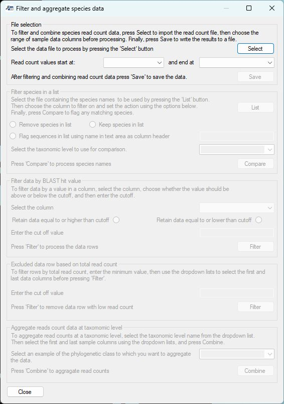

Figure 1: The  ___Filter and aggregate species data___ window that enables the data to be filtered and/or aggregated.

___

## Importing data

__Note:__ The  ___Filter and aggregate species data___ window was developed to process files exported by ___Taxonomic_NCBI___; however, it may be possible to process data from other sources as long as the sequence data is stored across a line in the file, the first line contains the column names and not data and it contains the required fields.

Pressing the ___Select___ button (blue line in Figure 2) of the ___File selection___ panel prompts you to select the data file. Once imported, select the titles of the first and last sample columns using the two dropdown lists (green line in Figure 2). Once data has been imported and the sample columns are set, all the options on the ___Tasks___ panel will become active. 

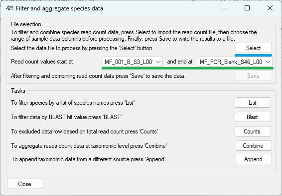

Figure 2: Pressing the ___Select___ button (blue line) allows you to import the data file, while selecting the first and last sample column (green line) causes all regions of the window to become active.

___

The ___Tasks___ region contains five buttons, which, when pressed, open a new window that will perform a filtering, annotation, or aggregating task on the read-count data.

- [Filter species by a list of species names](#filter-species-by-a-list-of-species-names)
- [Filtering sequence data based on the quality of the BLAST hit](#filtering-sequence-data-based-on-the-quality-of-the-blast-hit)
- [Exclude data based on its read-count across all samples](#exclude-data-based-on-its-read-count-across-all-samples)
- [Combine read-count data based on its taxonomy grouping](#combine-read-count-data-based-on-its-taxonomy-grouping)
- [Append taxonomic data from a different source](#appending-taxonomic-data-from-a-different-source)
- [Deleting unwanted columns](#deleting-unwanted-columns)
- [Renaming column names](#renaming-column-names)

## Filter species by a list of species names

__Note:__ While this function was designed to screen data by species name, it can be used with any taxonomic group such as _genus_ or _family_.

An annotated dataset may contain a very wide range of species, some of which may be of interest while others may be seen as incidental findings irrelevant to the project. Furthermore, some annotations may link reads to a closely related species that is present in the database used to annotate the data but is not present in the sampled environment. Consequently, it is often useful to compare the species identified in the samples to a list of species, with data removed or retained based on any matches. Similarly, rather than removing data, it may be advantageous to mark the species as hits or misses, with their status used in subsequent analysis. Therefore, ___Taxomic_NCBI___ can screen annotated data against a list of taxonomic names via the ___Filter data against list of names___  window (Figure 3), which is opened by pressing the __List__ button (red line in Figure 2).

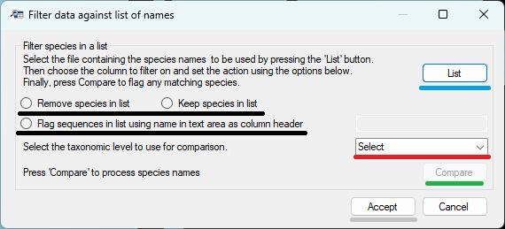

Figure 3: The  ___Filter data against list of names___ window allows data to be filtered by its taxonomic grouping.

---

__Screening the data consists of five steps:__

### Importing a list of names

Pressing the __List__ button (blue line in Figure 3) prompts you to select a file that contains the names. This file must be formatted such that each line contains one name. The filtering is not case sensitive but will only identify exact matches. For example, NCBI's taxonomic data lists humans as _Homo sapiens_, so human sequences will match _homo sapiens_ and _Homo Sapiens_, but not _H. sapiens_ or human. Similarly, the term _Escherichia coli_ will not match with _Escherichia coli strain 91_ or _E. coli_.

### Selecting the type of output

Whether a sequence is linked to a taxonomic name in the list may result in the sequence being retained, deleted or flagged as being in the list. This action is set using the three radio buttons (black lines in Figure 3) as follows.

- _Remove species in list_: the resultant data set doesn't contain data linked to names in the list.
- _Keep species in list_: the resultant data set only contains sequences linked to names in the list.
- _Flag sequences in list using name in text area as column header_: The resultant data contains all the sequences to which a new column has been appended that states whether the sequence was or was not in the list. The name of the append column is entered into the text box (blue line in Figure 4).

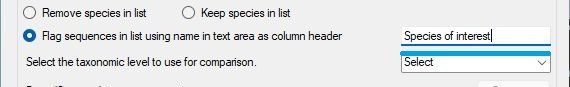

Figure 4.

---

### Select the column to be screened

While this function was intended to screen the data against a list of species names, it can be used to screen any column. This means that, in addition to species names, any other taxonomic classification can also be used. The column used is selected using the dropdown list (red line in Figures 14 and 16).

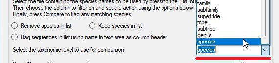

Figure 5.

---

### Performing the search

Once the previous three steps have been completed, the __Compare__ button will become active (green line in Figure 3), and pressing it will perform the comparison. Once complete, a message will appear telling you how many data rows were and were not in the list (Figure 6). If you select _Yes_ the results will be saved, while pressing _No_ will discard the analysis.  Once completed, it is possible to repeat the screening with a different list, with the results being accumulative.

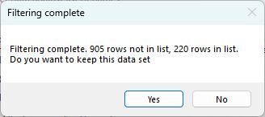

Figure 6.

---

### Saving the analysis

The results of the analysis are initially stored within the ___Filter data against list of names___ window and are not accessible by the rest of __Taxonomic_NCBI__. Therefore, to save the data, you must press the __Accept__ button (grey line in Figure 3). This will close the window and the results of the screening(s) replace the data in the __Taxonomic_NCBI__ program. The data can then be saved to a file by pressing the __Save__ button (purple line in Figure 2) or processed further by other functions on the ___Filter and aggregate species data___ window. Pressing the __Cancel__ button will discard the results and retain the original data.

## Filtering sequence data based on the quality of the BLAST hit

The data exported by __Taxonomic_NCBI__ after linking read data to taxonomic rank (see [Combining the annotated BLAST hit file and the read-count matrix file](#combining-the-annotated-blast-hit-file-and-the-read-count-matrix-file)) contains a _Percent identity_ and an _E score_ field as well as a _Hit length_. These columns can be used to filter the data to remove sequences that are likely to be incorrectly annotated. For example, poor hits can be removed by removing data that has a _Percent identity_ score below 99% or an _E score_ above 1.0e-20. Alternatively, amplicons that are either too long or too short to be the correct product can be removed by filtering twice for the _Hit length_, once setting the maximum length and then the minimum length.

Filtering by the numeric value in a field is performed by pressing the __BLAST__ button (yellow line on Figure 2). This will open the __Filter by BLAST value__ (Figure 7).

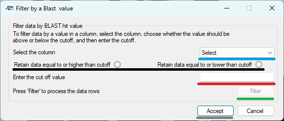

Figure 7.

---

The filtering by a BLAST hit value is performed with five steps as follows:

### Select the column's name to be filtered

Select the name of the data column you wish to filter using the dropdown list (blue line in Figure 7) on the __Filter by BLAST value__ window.

### Select how the filtering is performed

Selecting the __Retain data equal to or higher than cutoff__  (black line in Figure 7) should retain values lower than the cutoff, for example, when screening by  _E score_. The __Retain data equal to or higher than cutoff__ option (black line in Figure 7) should be used to keep values above the cutoff, for example, when filtering by _Percent identity_.  To remove amplicons that are the wrong size, first remove sequences that are too short and then perform a second round of filtering to remove sequences that are too long.

### Entering the cutoff value

The cutoff value is entered in the text area (red line in Figure 7). This value can be any value that can be converted to a number. For example, _99_ and _98.5_ will be accepted. Very large or small decimal numbers can be entered using scientific notation, i.e., '1.0e-25' will be processed as '0.00000000000000000000000001'. __Note:__ the 'e' must be lowercase. If the value cannot be converted to a number, a red warning will appear by the text box (Figure 8).

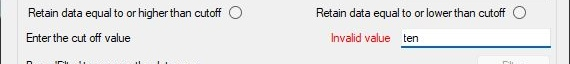

Figure 8.

---

### Preforming the analysis

Once the previous three steps have been performed, the __Filter__ button will become active and pressing it will filter the data. Once complete, a message will appear indicating how many data lines have been retained and how many were removed. Pressing the _Yes_ button will retain the analysis, while pressing _No_ will delete it. The data can be filtered a number of times with the results cumulative.

### Saving the analysis

The results of the analysis are initially stored within the __Filter by BLAST value__ window and are not accessible by the rest of __Taxonomic_NCBI__. Therefore, to save the data, you must press the __Accept__ button (grey line in Figure 7). This will close the window and the results of the screening(s) will replace the data in the __Taxonomic_NCBI__ program. The data can then be saved to a file by pressing the __Save__ button (purple line in Figure 2) or processed further by other functions on the ___Filter and aggregate species data___ window. Pressing the __Cancel__ button will discard the results and retain the original data.

## Exclude data based on its read count across all samples

An issue with any eDNA or microbiome analysis is the presence of a large number of sequences that are the result of a sequencing or PCR replication error. These sequences are often linked to very few reads and so can be safely deleted. To delete data rows that reference very few reads, press the __Counts__ button (black line in Figure 2). This will open the __Filter by total read count__ window (Figure 9).

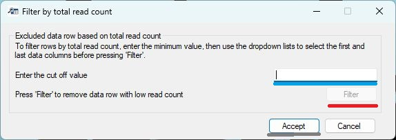

Figure 9.

---

The filtering by a BLAST hit value is performed with three steps as follows:

### Entering the minimum accumulative read-count cutoff

This value can be any value that can be converted to a number. For example _2000_ and _98.5_ will be accepted. Large numbers can be entered using  scientific notation, i.e., 1.0e4 will be read as 1,0000. __Note:__ the 'e' must be lowercase. If the value cannot be converted to a number, the __Filter__ button used for the next step will not become active and no analysis can be performed.  

### Performing the filtering

Pressing the __Filter__ button will prompt __Taxonomic_NCBI__ to calculate the number of reads linked to each row in the data set, and if the value is less than the cutoff, the line is deleted. Once the analysis is complete, a message will appear stating the number of data rows and linked reads that were retained or deleted (Figure 10).

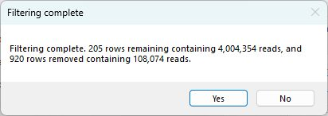

Figure 10.

---

### Saving the analysis

The results of the analysis are stored within  the __Filter by total read-count__ window and are not accessible by the rest of __Taxonomic_NCBI__. Therefore, to save the data, you must press the __Accept__ button (grey line in Figure 7). This will close the window and the results of the screening(s) replace the data in the __Taxonomic_NCBI__ program. The data can then be saved to a file by pressing the __Save__ button (purple line in Figure 2) or processed further by other functions on the ___Filter and aggregate species data___ window. Pressing the __Cancel__ button will discard the results and retain the original data.

## Combine read count data based on its taxonomy grouping

Many datasets contain a large number of species, which may make displaying the data difficult. Consequently, the data set may be filtered to remove data that is not required. Alternatively, data may be aggregated at the genus or family taxonomic level so that any subsequent analysis is performed at a higher taxonomic ranking. __Taxonomic_NCBI__ can aggregate data rows based on their taxonomic grouping, such as genus or family. 

__Note:__ Occasionally, a data set may contain multiple data rows linked to the same species; in this case, it may be beneficial to aggregate data at the species level.

__Note:__ When aggregating the data, the 'none' read-count information is retained from the first data row that matches a taxonomic identifier. Consequently, filtering on the value of a BLAST hit after aggregation will be unreliable.

__Note:__ When aggregating data rows, all columns after the filtering taxonomic class are deleted. This means that the taxonomic data must be at the end of each data row and if the data rows have been flagged using the [__Filter species by a list of species names__ > __Flag sequences in list using name in text area as column header__](#filter-species-by-a-list-of-species-names) function, this data will be lost.

__Note:__ All species contain all the taxonomic groupings used in the NCBI's taxonomic scheme. For instance, while all species have a _family_ value, not all species have a _subfamily_.

Aggregating data rows based on their taxonomy annotation is performed by pressing the __Combine__ button (lime line on Figure 2). This will open the __Aggregate by taxonomy__  window (Figure 11).

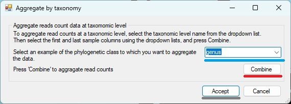

Figure 11.

---

Aggregating data is performed in three steps: 

### Select the column used to aggregate the data

Select the name of the data column you wish to use in the aggregation process using  the dropdown list (blue line in Figure 7) on the __Aggregate by taxonomy__ window.

### Perform the aggregation step

Once the relevant data column has been selected, the __Combine__ button (red line in Figure 11) will become active. Pressing this button will start the aggregation of the data and when complete, a message will appear comparing the number of data rows were created to the number in the initial dataset (Figure 12).

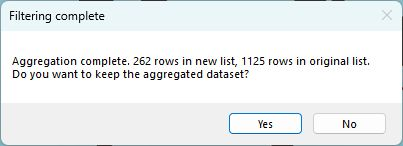

Figure 12.

---

### Saving the analysis

The results of the analysis are initially stored within  the __Aggregate by taxonomy__ window and are not accessible by the rest of __Taxonomic_NCBI__. Therefore, to save the data, you must press the __Accept__ button (grey line in Figure 11). This will close the window and the results of the aggregation step replace the data in the __Taxonomic_NCBI__ program. The data can then be saved to a file by pressing the __Save__ button (purple line in Figure 2) or processed further by other functions on the ___Filter and aggregate species data___ window. Pressing the __Cancel__ button will discard the results and retain the original data.

## Appending taxonomic data from a different source

While the NCBI's taxonomic schema is used by many people, it does have known issues. Consequently, users may wish to append taxonomic annotation from a different source to each data row. These schemas may be curated by sources such as BOLD, SILVA, MIMt, PR2 or WoRMS. The [Bash and Python](../Bash_and_Python_scripts/) folder contains a number of scripts that may be useful in generating files containing various taxonomic schemas from these sources.

Pending taxonomic data to each data row is performed by pressing the __Append__ button (pink line on Figure 2). This will open the __Append taxonomic data to a file__  window (Figure 13).

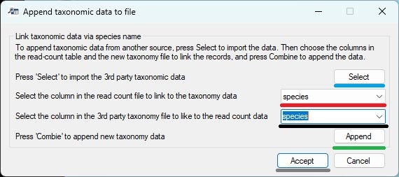

Figure 13.

---

Appending data is performed in five steps as follows:

### Importing the taxonomic data

The taxonomic data is imported as a text file by pressing the __Select__ button (blue line in Figure 13). In this file each line contains a species' taxonomic data, with each ranking separated by a 'Tab' character. Ideally, the first line will contain the name for each taxonomic ranking (i.e. _species_, _family_ or _genus_). If it is not possible to get this data, the first line should be empty and __Taxonomic_NCBI__ will refer to each column by the letters __A__ to __Z__, if there are more entries, the subsequent columns will be labelled __AA__ to __AZ__ and then __BA__ to __BZ__ and so on.

### Selecting the NCBI taxonomic ranking column

Use the upper dropdown list (red line in Figure 13) to select the taxonomic rank used by the NCBI schema you wish to link to the new taxonomic schema. 

### Select the taxonomic ranking in the new schema

Use the lower dropdown list (black line in Figure 13) to select the taxonomic rank used by the new schema you wish to link to NCBI's taxonomic schema. 

### Appending the data

Once the previous three steps have been performed, the __Append__ button (green line in Figure 13) will be activated and pressing it starts the process. Once it has been completed, a message will appear stating how many data rows have and have not been modified.

### Saving the analysis

The results of the analysis are initially stored within  the __Append taxonomic data to a file__ window and are not accessible by the rest of __Taxonomic_NCBI__. Therefore, to save the data, you must press the __Accept__ button (grey line in Figure 13). This will close the window and the results of this analysis step will replace the data in the __Taxonomic_NCBI__ program. The data can then be saved to a file by pressing the __Save__ button (purple line in Figure 2) or processed further by other functions on the ___Filter and aggregate species data___ window. Pressing the __Cancel__ button will discard the results and retain the original data.

## Deleting unwanted columns

The annotated read-count matrix may contain a number of columns that are not required for any subsequent analysis and so can safely be removed from the data set. This can be performed by pressing the __Remove__ button (**brown** line on Figure 2), which will open the __Remove data columns__  window (Figure 13).

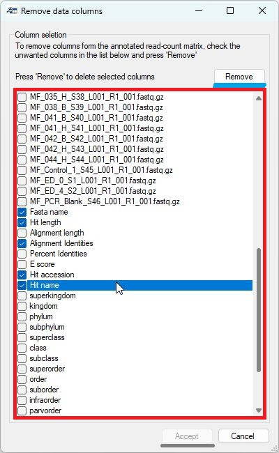

Figure 14.

---

The removal of unwanted columns is performed in 3 steps:

### Selecting the unwanted columns

When the __Remove data columns__ window opens, each column header name is displayed by a tick box (red box in Figure 14). Checking the tick box selects the related column for removal from the data set. For instance, Figure  25 shows the _Fasta name_, _Hit length_, _Alignment identities_, _Hit accession_ and _Hit name_ columns are marked for removal.

__Note:__ Any column can be removed.

### Removing the columns

Pressing the __Remove__ button (blue line in Figure 14) will delete the selected data columns from the data set. When completed, a message appears asking if you want to save the changes to the local copy of the data. If the changes are accepted, the __Remove data columns__  window's __Accept__ button becomes active.

### Saving the changes to a file

The results of the analysis are stored within  the __Remove data columns__ window and are not accessible to the rest of __Taxonomic_NCBI__. Therefore, to save the data, you must press the __Accept__ button (grey line in Figure 14). This will close the window and the new data set will replace the original one held by __Taxonomic_NCBI__. The data can then be saved to a file by pressing the __Save__ button (purple line in Figure 2) or processed further by other functions on the ___Filter and aggregate species data___ window. Pressing the __Cancel__ button will discard the results and retain the original data.

## Renaming column names

Where possible, __Taxonomic_NCBI__ uses the column headers inherited from the original data. If a file contained no column names, __Taxonomic_NCBI__ creates them in the same manner as Excel labels columns, i.e., __A__ to __Z__, then __AA__ to __AZ__ and then __BA__ to __BZ__ and so on. Consequently, it may be necessary to modify these names so they are more meaningful or concise.  __Taxonomic_NCBI__ allows you to edit column names by two methods via the __Rename columns__ window. 

Renaming the columns is performed by pressing the __Rename__ button (grey line on Figure 2). This will open the __Rename columns__ (Figure 15).

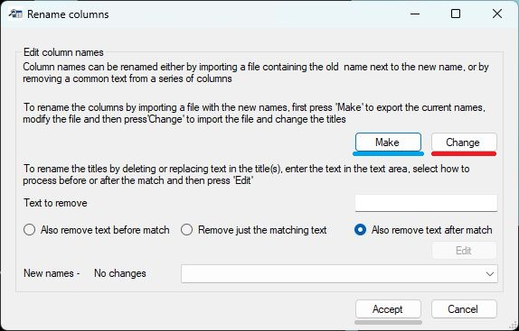

Figure 15.

---

## Renaming the column names using a saved list of names created by __Taxonomic_NCBI__

Renaming the columns using a list of the current names saved to a file is performed in four steps using the __Make__ and __Change__ buttons as follows:

### Creating and editing a list of the current column names

Pressing the __Make__ button (blue line in Figure 15) prompts you to select a file to save the current names too and then create a text consisting of two lines of descriptive text followed by the name of each column a __tab__   character and then the column's name again. To change a column's name, edit the second instance of the name as shown in Figure 16. In this example, the current name was derived from the sample's file name (red box in Figure 6a) and has been renamed with a more concise name (blue box in in Figure 16a).

If a name occurs more than once, subsequent occurrences are labelled as: __\<Current name>__ + __":/"__ + __\<number>__. For instance, in Figure 16b, the name B.fastq.gz appears twice, with the second occurrence marked with the __:.1__ suffix (blue line in Figure 16b). This allows you to edit one instance without affecting the other. 

Once you have edited the column names, save the text file.

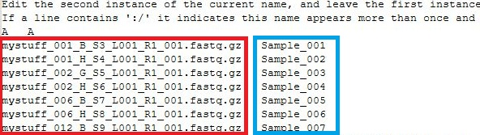

Figure 16a.

---

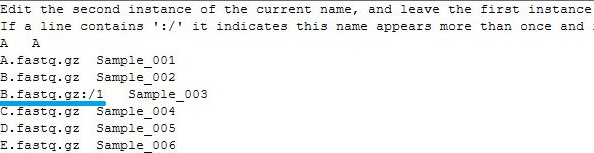

Figure 16b.

---

### Importing a list of modified column names

Once you have edited the file of column names, press the __Change__ button (red line in Figure 15) and select the file. These will then be imported and matched to the current column names. When complete, __Taxonomic_NCBI__ will display a message stating how many columns are in the current read-count matrix, how many were changed and how many data lines were in the imported file. Press the __Yes__ button to cause the current edits to be saved.

__Note:__ The imported file does not need to contain all the columns in the read-count matrix - if a name is omitted, the name in the matrix will not be changed.

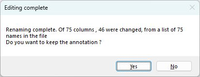

Figure 17.

---

### Saving the analysis

The results of the column name editing are initially stored within the __Rename columns__ window and are not accessible by the rest of __Taxonomic_NCBI__. Therefore, to save the data, you must press the __Accept__ button (grey line in Figure 15). This will close the window and the results of the screening(s) will replace the data in the __Taxonomic_NCBI__ program. The data can then be saved to a file by pressing the __Save__ button (purple line in Figure 2) or processed further by other functions on the ___Filter and aggregate species data___ window. Pressing the __Cancel__ button will discard the results and retain the original data.

## Renaming column names that match user-defined text

When column names are derived from sample file names, they may contain a significant amount of duplicated text that could be removed; for instance, Illumina data files may follow the format of  
__\<sample name>\_S\_<sample number>_\<lane id>\_\<read id>\_\<legacy text>.\<flie extension>__

For example:  
Sample_001_B_S3_L001_R1_001.fastq.gz   
Sample_001_H_S4_L001_R1_001.fastq.gz   
Sample_002_G_S5_L001_R1_001.fastq.gz   
Sample_002_H_S6_L001_R1_001.fastq.gz   
Sample_006_B_S7_L001_R1_001.fastq.gz  

## Removing a common prefix

In the example above all the samples start with the text __Sample\___. To remove this, enter "__ple\___" in the text area (blue line in Figure 18) and select the __Also remove text before match__ option (red line in Figure 18). A preview of the changes can be seen by selecting an entry in the dropdown list (black line in Figure 18). If the required edit is performed on all the samples, press the __Edit__ button (green line in Figure 18) to modify the local version of the column names.

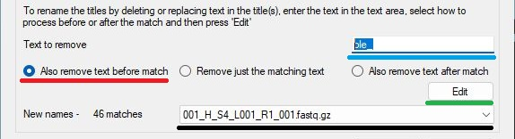

Figure 18.

---

## Only removing the word matching the text

In the example above, all the samples contain   the text __\_L001\_R1\_001__. To remove this, enter "__\_L001\_R1\_001__" in the text area (blue line in Figure 19) and select the __Remove just the matching text__ option (red line in Figure 19). A preview of the changes can be seen by selecting an entry in the dropdown list (black line in Figure 19). If the required edit is performed on all the samples, press the __Edit__ button (green line in Figure 19) to modify the local version of the column names.

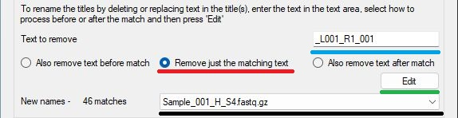

Figure 19.

---

## Removing a common suffix

In the example above all the samples end with the text __\_L001\_R1\_001.fastq.gz__. To remove this, enter "__\_L001__" in the text area (blue line in Figure 20) and select the __Also remove text before match__ option (red line in Figure 20). A preview of the changes can be see by selecting an entry in the dropdown list (black line in Figure 20). If the required edit is performed on all the samples, press the __Edit__ button (green line in Figure 20) to modify the local version of the column names.

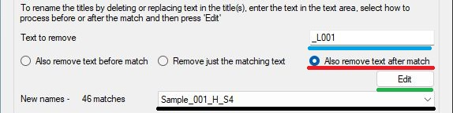

Figure 20.

---

### Accepting the local changes

Whichever option is used, pressing the __Edit__ button will modify the column names and display a message stating how many columns there are and how many have their names modified. Pressing the __Yes__ button on the message box will save the modifications to the __Rename columns__ window but not to the data held by __Taxonomic_NCBI__.

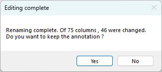

Figure 21.

---

### Saving the analysis

The results of the column name editing are initially stored within the __Rename columns__ window and are not accessible by the rest of __Taxonomic_NCBI__. Therefore, to save the data, you must press the __Accept__ button (grey line in Figure 15). This will close the window and the results of the screening(s) will replace the data in the __Taxonomic_NCBI__ program. The data can then be saved to a file by pressing the __Save__ button (purple line in Figure 2) or processed further by other functions on the ___Filter and aggregate species data___ window. Pressing the __Cancel__ button will discard the results and retain the original data.

## User Guide

- Main
   - [Manually search the taxonomy data](manualSearch.md)
   - [Process a BLAST hits result file](processABLASTHitFile.md)
        - [Annotate BLAST hit file](annotateBlastHitFile.md)
        - [Edit annotated BLAST hit file](editingTheBlastAnnotationFile.md)
   - [Link annotated Blast hits to read-count file](linkReadCountsToTaxonomicData.md)
   - [Filtering, editing and aggregate the annotated read counts file](filteringAndAggregatingData.md)

