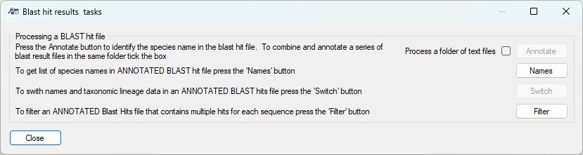
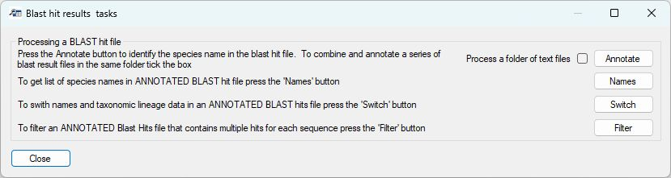

## User Guide

- [Main](README.md)
   - [Manually search the taxonomy data](manualSearch.md)
   - Process a BLAST hits result file
        - [Annotate BLAST hit file](annotateBlastHitFile.md)
        - [Edit annotated BLAST hit file](editingTheBlastAnnotationFile.md)
   - [Link annotated Blast hits to read-count file](linkReadCountsToTaxonomicData.md)
   - [Filtering, editing and aggregate the annotated read counts file](filteringAndAggregatingData.md)  
# Working with a BLAST hits file

The ___Blast hit results file___ (Figures 1a and 1b) allows you to annotated a BLAST hits file with taxonomic data and then to further process the __annotated__ BLAST hits result file.

Figure 1a: If taxonomic data has not been imported the ___Annotate___ and ___Switch___ buttons are inactive.

Figure 1a: If taxonomic data has been imported the ___Annotate___ and ___Switch___ buttons are active.

## Annotating the BLAST hit file

__Note:__ To annotate a BLAST hits file taxonomic lineage data you must have loaded the NCBI taxonomic data.

The annotation of a BLAST hit file is performed as described e [here](../Guide/annotateBlastHitFile.md). 

## Editing the annotation

__Note:__ To switch taxonomic lineage data from one species to another, you must have loaded the NCBI taxonomic data.

The editing of the taxonomic annotation file is performed as described [here](editingTheBlastAnnotationFile.md).

## User Guide

- Main
   - [Manually search the taxonomy data](manualSearch.md)
   - [Process a BLAST hits result file](processABLASTHitFile.md)
        - [Annotate BLAST hit file](annotateBlastHitFile.md)
        - [Edit annotated BLAST hit file](editingTheBlastAnnotationFile.md)
   - [Link annotated Blast hits to read-count file](linkReadCountsToTaxonomicData.md)
   - [Filtering, editing and aggregate the annotated read counts file](filteringAndAggregatingData.md)
