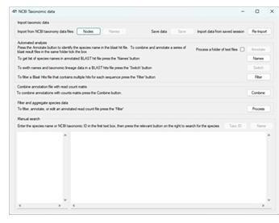

#  ```Taxonomic NCBI```

#### Contents
- [Introduction](#Introduction)
- [Guide](#guide)
- [Download](#download)
- [Running on macOS, Linux and BSD PCs](#running-on-macos-linux-or-bsd-computers)

## Introduction



```Taxonomic NCBI``` is designed to annotate a read count file with the sequence's species of origin initially using NCBI's GenBank and taxonomic data. A generic workflow is given below, but it should be noted that as ```Taxonomic NCBI``` processes plain text files, there is not set method to create the read count file or identify a sequence's origin as long as the file have a consistent format and contain the required data.  

___A generic workflow:___

- A BLAST database is searched with blastn to identify hits for each sequence in the read count file. This database can be a NCBI genBank database or a custom database created using for example with SILVA or BOLD data. 
- The Hits sequence descriptor is used to identify the species of origin.
- The NCBI Taxonomy data set is then searched using the species name to obtain the sequence's Taxonomic data.
- The data is then linked to the BLAST results file.
- The annotated BLAST results file is then combined with the read counts file to produce a reads count matrix annotated with taxonomic data.
- The annotated reads count file can then be filtered and aggregated with respect to:
    - If the  species linked to a sequence is not present in the sampled habitat, but a close relative is, the species data can be switched.
    - The sequence's BLAST hit results: percent identity and or e score, etc.
    - A sequence's total read count. 
    - Sequences can be flagged or filtered if the sequence's taxonomic data (i.e., species name) is present in a 2nd file.
    - Read count data can be aggregated based on whether sequences share the same taxonomic grouping i.e. same species or family name. 

```Taxonomic NCBI``` is written to be flexible and so can process sequence descriptors from a range of sources such as the SILVA data set or standard GenBank sequence description. The only requirement for automated analysis is that the the descriptions have a consist format structure.

As well as allowing the automated annotation of a file, ```Taxonomic NCBI``` will also allow you to perform manual searchers using either names (common English or Latin) or the species' NCBI taxonomy ID number. 


## Guide

The ```Taxonomic NCBI``` guide is [here](Guide/README.md).

## Download

The compiled program can be downloaded from [here](Program/).

## Running on macOS, Linux or BSD computers

```Taxonomic NCBI``` can run on arrange of non-Windows PCs that have an Intel or AMD processor as described [here](https://github.com/msjimc/RunningWindowsProgramsOnLinux).

